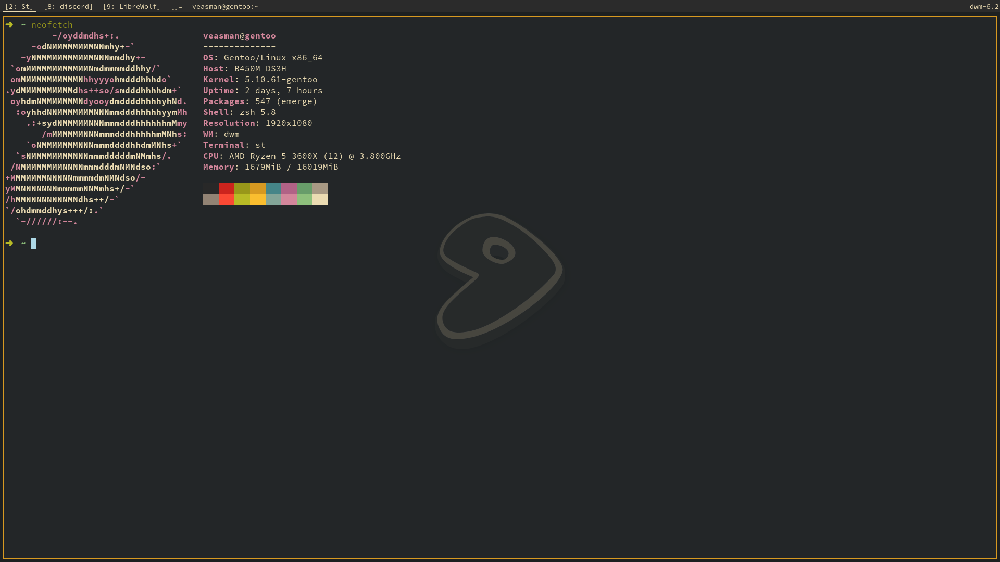

# veasman's build of dwm

<br />
<p align="center">
  <a href="https://github.com/veasman/Monke">
    
  </a>
</p>

## Patches and features

- Fullscreen toggle: Press Mod+Shift+F to make a window fullscreen
- Alpha: The panel (or "bar") is translucent
- Bar height: Set a custom height for the panel/bar
- Full gaps: Adds an adjustable gap between windows
- Hide vacant tags: Hides the label for any tags with nothing running in them
- Scratchpad: A popup terminal that can be accessed with Mod+\`
- Tag labels: Tags appear as a number + the currently selected window inside the tag
- Underline tags: Adds an underline to the currently active tag(s)

## How to install
```
git clone https://github.com/veasman/dwm.git
cd dwm
sudo make install
```
